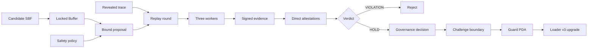
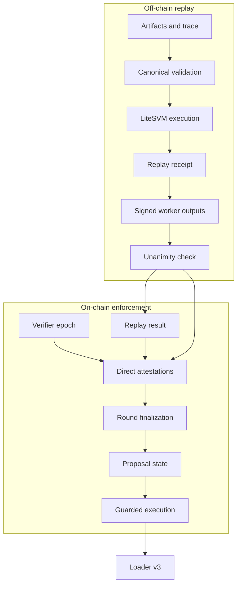
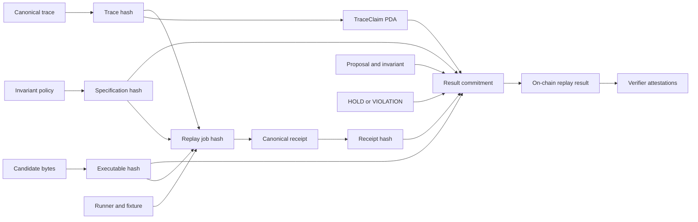
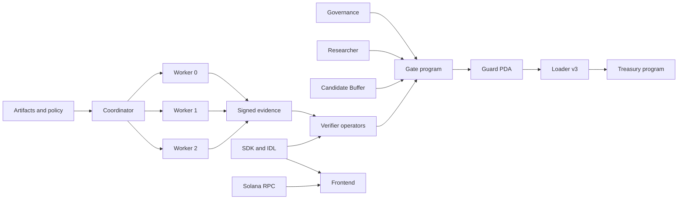
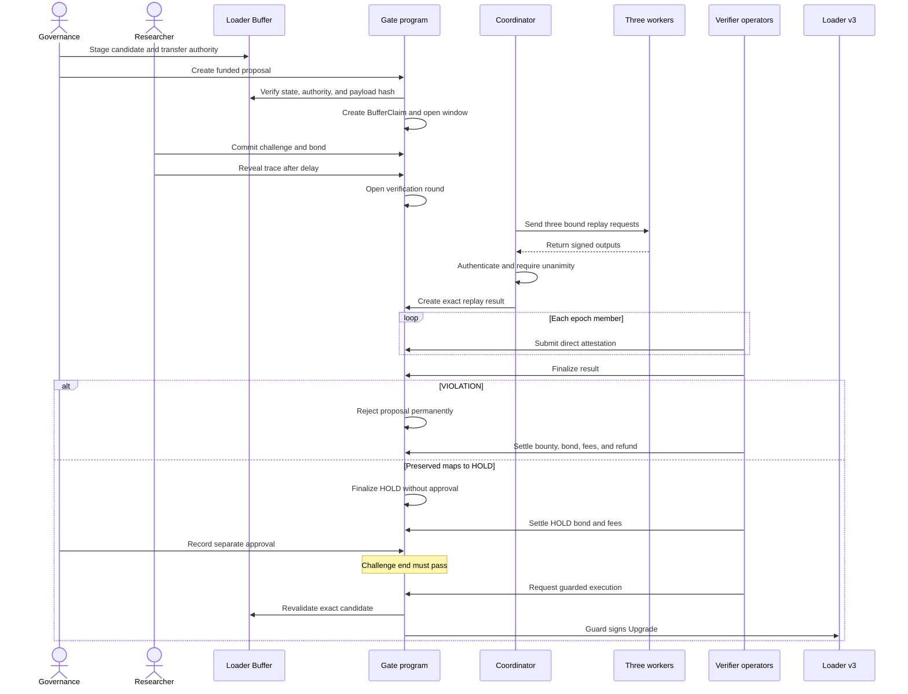
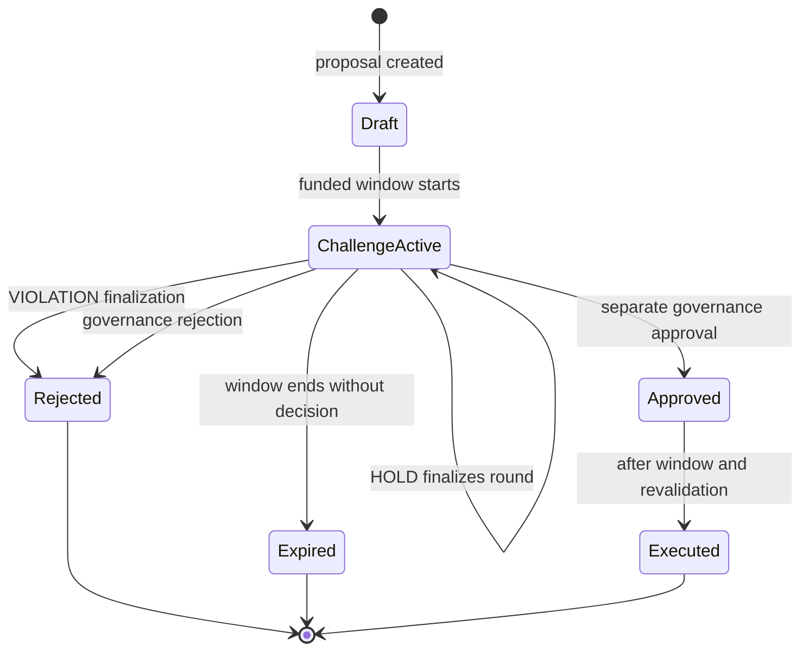

# Faultline

<p align="center">
  
</p>

**Verify the candidate. Enforce the decision. Upgrade through the Guard.**

Faultline places an enforceable gate in front of a loader-v3 program upgrade. A proposal binds a staged executable, a declared safety policy, a challenge window, and economic terms. Bounded counterexample traces are replayed deterministically off chain; authenticated verifier results are committed and attested on chain; the Gate program then rejects, holds, approves, expires, or executes the exact candidate according to the recorded state.

Faultline is not a generic vulnerability scanner and does not certify that a program is secure. It tests specific, declared invariants against pinned artifacts and evidence, then enforces the resulting decision at the upgrade-authority boundary.

[See the safety story](#the-reference-safety-story) · [Run the frontend](#frontend) · [Understand the architecture](#system-architecture) · [Reproduce locally](#local-development) · [Review limitations](#security-model-and-limitations)

## Table of contents

- [Why Faultline exists](#why-faultline-exists)
- [Faultline at a glance](#faultline-at-a-glance)
- [The reference safety story](#the-reference-safety-story)
- [Visual architecture overview](#visual-architecture-overview)
- [What Faultline does](#what-faultline-does)
- [Project status](#project-status)
- [Choose where to start](#choose-where-to-start)
- [How it works](#how-it-works)
- [System architecture](#system-architecture)
- [Upgrade lifecycle](#upgrade-lifecycle)
- [Decision and state model](#decision-and-state-model)
- [On-chain programs](#on-chain-programs)
- [Deterministic replay](#deterministic-replay)
- [Verifier and quorum model](#verifier-and-quorum-model)
- [Worker isolation](#worker-isolation)
- [Attestation and settlement flows](#attestation-and-settlement-flows)
- [SDK, IDL, and CLI](#sdk-idl-and-cli)
- [Frontend](#frontend)
- [Technology stack](#technology-stack)
- [Repository structure](#repository-structure)
- [Local development](#local-development)
- [Configuration and security](#configuration-and-security)
- [Testing and verification](#testing-and-verification)
- [Security model and limitations](#security-model-and-limitations)
- [Current status and roadmap](#current-status-and-roadmap)
- [Documentation](#documentation)
- [License and contribution](#license-and-contribution)

## Why Faultline exists

An upgradeable Solana program can keep the same public address while replacing the executable behind its loader `ProgramData` account. Governance may authorize that change, but governance approval alone does not prove that the new bytes preserve the properties users depend on. Reviews and CI can warn about a regression without controlling whether it reaches production.

Faultline moves the safety decision to the deployment boundary. The target program's loader-v3 upgrade authority is a Guard PDA controlled by the Gate program. A candidate must be staged in a loader Buffer, locked to the Guard, hashed, challenged, replayed, and resolved before that PDA can sign the loader upgrade. A confirmed violation makes rejection terminal on the guarded path. A clean replay produces a non-approving HOLD; governance must still make a separate approval decision, and execution must wait until the challenge boundary has passed.

The implemented reference invariant, `AUTH-001`, protects a treasury against unauthorized token outflow. It demonstrates a concrete v2 authority-migration regression and the corresponding v3 patch under one stable program ID.

| Without an enforced gate | With Faultline |
| --- | --- |
| Governance approves a proposal, but the candidate bytes may remain weakly connected to the review. | The proposal and verification round bind the exact loader Buffer and executable payload digest. |
| A warning from CI, an auditor, or a researcher can still be ignored during deployment. | A quorum-confirmed invariant violation moves the proposal to terminal `Rejected` on the guarded route. |
| “Tests passed” can sound like a general security certificate. | Results are scoped to one policy, candidate, fixture, trace, runtime, receipt, and verifier epoch. |
| The upgrade key can deploy directly. | The Guard PDA is the loader authority and signs only through the Gate's checked execution instruction. |
| Off-chain services may become an accidental source of truth. | On-chain accounts and loader authority decide; the frontend and future indexers are derived views. |

## Faultline at a glance

| Question | Answer |
| --- | --- |
| What is protected? | The normal upgrade path of an upgradeable Solana program using loader v3. |
| What is tested? | Declared executable invariants against a pinned candidate, fixture, and bounded trace. |
| What runs off chain? | Canonical input validation, LiteSVM replay, invariant evaluation, receipt construction, and worker-output authentication. |
| What is enforced on chain? | Account bindings, verifier membership, distinct attestations, quorum, timing, rejection, approval prerequisites, economics, and the loader CPI. |
| What does `VIOLATION` mean? | The configured quorum reproduced the declared invariant failure; the proposal is automatically and terminally rejected. |
| What does `HOLD` mean? | The bound replay preserved the declared invariant. It is non-approving and still requires a separate governance decision. |
| What is the demonstrated quorum? | Three workers, three distinct verifier identities, one immutable three-member epoch, threshold 3. |
| What can I use today? | Solana programs, local-validator demonstrations, deterministic replay, workers/coordinator, SDK, IDLs, operator CLI, and a local interactive frontend. |
| What is not claimed? | Generic vulnerability detection, formal verification, production Byzantine security, audit certification, or a public-network deployment. |

## The reference safety story

Faultline ships a deliberately small example that makes the entire mechanism inspectable:

| Version | Treasury behavior | Same attack trace | Faultline meaning |
| --- | --- | --- | --- |
| v1 | Safe baseline; migration unavailable | Establishes the initial fixture | Current deployed program in the demonstration |
| v2 | Vulnerable authority migration accepts the replacement signer without the stored admin | Attacker captures authority and withdraws 100 tokens | `VIOLATION` → terminal rejection → bounty and fee settlement |
| v3 | Patched migration requires the current stored admin to sign | Unauthorized migration fails and protected balances remain unchanged | `Preserved` → non-approving HOLD → separate governance approval → guarded upgrade after the time boundary |

The important point is the boundary, not merely the bug. v2 cannot ship through the Guard after the confirmed violation. v3 is not called “secure”; its replay result says only that `AUTH-001` was preserved for the exact bound trace and execution environment.

You can explore the complete story without a wallet in the frontend's `/demo` route. It is an explicitly labeled local simulation. The real protocol demonstrations use the PowerShell/local-validator commands under [Local development](#local-development).

## Visual architecture overview

The three diagrams below show the core product before the detailed protocol reference.

### From candidate to enforced decision



The Buffer is locked before the challenge process. A VIOLATION ends at rejection. HOLD reaches the execution path only after a separate approval and the required slot boundary.

### On-chain and off-chain responsibilities



Workers execute the replay, but their signatures do not directly change Solana state. Configured verifier identities submit normal signed transactions; the Gate verifies accounts, membership, commitments, quorum, timing, and state transitions.

### Evidence and commitment chain



Each layer binds the next one. Proposal and round accounts snapshot the candidate, invariant, trace claim, epoch, and threshold; the on-chain replay-result commitment also includes the verdict and replay-receipt hash.

## What Faultline does

- **Binds the candidate.** A proposal records the target Program, derived `ProgramData`, exact loader-v3 Buffer, and SHA-256 of only the Buffer's executable payload. Loader metadata is excluded from the digest, while owner, state, metadata length, authority, claim, and account identity are checked independently.
- **Registers executable policy.** A `SafetyPolicy` selects challenge timing and verifier requirements; immutable invariant accounts bind typed invariant metadata and a specification hash.
- **Accepts private-first challenges.** Researchers commit a domain-separated hash, wait through the minimum reveal boundary, then reveal a trace hash into a canonical `TraceClaim`. Funded flows escrow a bounty, fee reserve, and challenger bond.
- **Replays deterministically.** A standalone Rust engine validates closed canonical JSON schemas, loads pinned fixtures and SBF artifacts into LiteSVM, normalizes execution results, evaluates `AUTH-001`, and produces a hash-bound receipt.
- **Authenticates verifier evidence.** Three separate workers are used in the demonstrated flow. Each request carries a distinct ordinal, coordinator nonce, expected identity, and replay-job hash. Each eligible output is signed with Ed25519.
- **Enforces decisions on chain.** Direct Solana attestations increment one exact replay result. `InvariantViolated` automatically rejects the proposal; `InvariantHolds` finalizes the round as HOLD without approving it.
- **Settles objective economics.** The program supports bounty payment, bond return or defined penalty, verifier fees, objective non-reveal slashing, timeout/abort refunds, residual escrow refunds, vault closure, and permanent receipt/tombstone accounts.
- **Executes the guarded upgrade.** After a separate governance approval and strictly after the challenge end slot, the Gate revalidates all bindings and invokes loader-v3 `Upgrade` with the Guard PDA as signer.

## Project status

| Status | Capability |
| --- | --- |
| Implemented and verified | Guard PDA custody and loader-v3 execution; v1/v2/v3 Treasury artifacts; proposal, invariant, commit/reveal, verifier epoch, replay-result, direct-attestation, and economic account flows; deterministic v2/v3 LiteSVM replay; three-worker authenticated unanimity; public SDK and generated IDLs; unsafe v2 rejection and settlement on a fresh local ledger. |
| Implemented, final integration validation incomplete | The v3 workers return `Preserved`, the round finalizes as non-approving HOLD, governance approval is separate, and guarded loader-v3 execution is implemented. The dedicated end-to-end fresh-ledger validation for this complete path has not been closed successfully in the preserved repository state, so Faultline does not present it as fully verified. |
| Intentionally simulated in the frontend | Proposal actions, challenge steps, worker progress, attestations, settlement, governance approval, eligibility delay, and v3 execution in Demo Mode. The UI labels these states as simulation and does not create transactions. |
| Deferred | Indexer/API and artifact services; wallet signing and transaction broadcast in the frontend; permissionless verifier admission and assignment; heterogeneous runners; stronger OS sandboxing; hardware/HSM/remote key custody; production operational hardening and audit preparation. |

No repository evidence establishes a devnet or mainnet deployment.

## Choose where to start

| If you are… | Start with… | Then inspect… |
| --- | --- | --- |
| Evaluating the project | [`frontend/`](frontend/) and the `/demo` route | [Project status](#project-status), [upgrade lifecycle](#upgrade-lifecycle), and [limitations](#security-model-and-limitations) |
| A Solana developer | [Gate source](programs/faultline_gate/src/lib.rs) | [On-chain programs](#on-chain-programs), loader authority proof, and local-validator commands |
| A security reviewer | [Architecture and threat model](docs/Architecture.md) | Replay schemas, assertion ledgers, trust boundary, settlement rules, and known limitations |
| A verifier operator | [Replay workspace](crates/faultline-replay/) | [Verifier model](#verifier-and-quorum-model), [worker isolation](#worker-isolation), and CLI commands |
| An SDK integrator | [`@faultline/sdk`](packages/faultline-sdk/) | Generated IDLs, strict account decoding, instruction builders, and RPC configuration |
| A frontend contributor | [Frontend implementation notes](frontend/IMPLEMENTATION.md) | Routes, Demo/RPC separation, accessibility, motion, and [frontend QA](frontend/QA_REPORT.md) |

## How it works

1. Governance initializes a policy and makes the Guard PDA the target `ProgramData` upgrade authority.
2. A candidate `.so` is written to a loader-v3 Buffer. Buffer authority is transferred to the Guard so the proposer cannot rewrite it.
3. Proposal creation verifies the Program/ProgramData relationship, Guard authority, Buffer authority and state, calculates the payload-only executable hash, and creates a single-use `BufferClaim`.
4. The proposal is funded and enters `ChallengeActive` for a slot-bounded window. A researcher commits a hash of the proposal, invariant, hunter, trace hash, and salt, then reveals after the required delay.
5. A verification round snapshots the trace, candidate hash, invariant specification hash, verifier epoch, and threshold. Funded rounds also bind the economic policy and stake accounts.
6. Off chain, the coordinator builds three public worker requests with unique nonces and ordinals. Each worker validates the closed schemas and repository-relative inputs, runs the same normalized trace in LiteSVM, evaluates the invariant, builds a canonical receipt, and signs its output.
7. The coordinator verifies identity, signature, nonce, ordinal, replay-job hash, receipt, result commitment, and all cross-worker fields. It emits no attestation intent if any worker is ineligible or the three identity-independent projections disagree.
8. On chain, a replay-result account stores the verdict and receipt hash. Each configured verifier separately signs a Solana transaction that creates one direct attestation for that result. Worker signatures authenticate off-chain evidence; Solana transaction signatures authorize on-chain votes.
9. Permissionless finalization requires the round threshold. VIOLATION changes the proposal to terminal `Rejected`. Preserved maps to HOLD: the round becomes `InvariantHolds`, but the proposal remains `ChallengeActive`.
10. Economic settlement follows the objective round outcome. HOLD still cannot execute. Governance may record a separate temporary approval only when no round is pending and no violation is confirmed.
11. Guarded execution is permitted only from `Approved`, strictly after the inclusive challenge end slot, and after another complete validation of the target, ProgramData, Buffer, claim, authority, and executable digest. A successful loader CPI changes the proposal to `Executed`.

Replay is deliberately off chain because the Gate does not run an SVM inside the SVM. Enforcement remains on chain: canonical accounts, signatures, immutable snapshots, quorum counts, terminal rejection, timing, settlement eligibility, and loader authority are program rules.

The frontend has two explicit data modes. Demo Mode uses local deterministic state. RPC Mode requires an endpoint and expected genesis hash, decodes genuine Gate accounts with the committed SDK/IDL, and reports transport, genesis, ownership, discriminator, or decoding failures. It never falls back to demo records when an RPC read fails, so simulated data cannot silently become chain truth.

## System architecture



The principal components are:

- **Gate program:** the Anchor program that owns protocol state and the sole Guard-signed loader upgrade route. Local proof runners finalize its deployed loader program so the authority layer itself is immutable for those runs.
- **Guard PDA:** the recorded loader-v3 upgrade authority for a target program. It has no general signing endpoint; `execute_guarded_upgrade` is the route that invokes `Upgrade`.
- **Upgradeable-loader accounts:** the executable Program, its derived `ProgramData`, the staged candidate Buffer, and the spill/sysvar accounts required by loader-v3.
- **Treasury reference program:** one program ID with v1 baseline, intentionally vulnerable v2, and patched v3 builds. The stable account layout allows the same fixture and exploit trace to be tested across versions.
- **Replay engine:** an independent Cargo workspace using LiteSVM and a pinned Solana runtime family. It consumes bytes and canonical data instead of linking the on-chain crates.
- **Workers and coordinator:** bounded Windows child processes, framed pipes, authenticated output, deterministic agreement, and fail-closed cleanup.
- **Operator CLI:** the implemented `faultline` binary for one-verifier execution and three-output quorum verification.
- **SDK and IDL packages:** strict TypeScript account decoding, PDA derivation, instruction construction, commitment parity, transaction bounds, replay schemas, and generated public program descriptions.
- **Artifacts, fixtures, policies, and manifests:** tracked canonical JSON and the bundled Tokenkeg program establish replay inputs and provenance. Treasury and Gate SBF outputs under `artifacts/` are generated locally and ignored by Git.
- **Frontend:** a Vite/React product surface with deterministic demo state and a read-only, fail-closed RPC adapter.

## Upgrade lifecycle



## Decision and state model



`HOLD` is product language for an `InvariantHolds` replay verdict and round status. It is not an `UpgradeProposal` enum variant and does not move the proposal to `Approved`. A revealed challenge must respect the commit/reveal delay, a new round must have at least the configured verification time remaining, attestations and finalization must land no later than the challenge end slot, and execution requires a slot strictly greater than that end. Settlement updates economic accounts and vaults; it does not create an approval transition.

## On-chain programs

### Gate

`programs/faultline_gate` is an Anchor 0.30.1 program pinned to `solana-program` 1.18.10. Its account model includes:

| Area | Accounts and purpose |
| --- | --- |
| Authority | `GuardConfig` binds target and governance; `BufferClaim` makes the exact candidate Buffer single-use. |
| Policy and proposal | `SafetyPolicy`, `UpgradeProposal`, and `InvariantDefinition` record the target, timing, candidate, state, and immutable invariant commitments. |
| Challenge | `ChallengeCommit` holds the domain-separated commitment and reveal bounds; `TraceClaim` binds the revealed trace to the proposal, invariant, hunter, and commit. |
| Verification | `VerifierRegistry` selects an active immutable `VerifierEpoch`; `ProposalVerificationGate` counts pending rounds and records a confirmed violation; `VerificationRound`, `ReplayResult`, and `VerifierAttestation` bind snapshots, verdicts, receipts, and distinct votes. |
| Economics | `EconomicPolicyRegistry` and immutable `EconomicPolicy` versions define Tokenkeg mint and amounts. `ProposalEscrow`, `ChallengeBond`, `VerifierStake`, `VerifierEpochEconomics`, and `RoundEconomicState` track liabilities and timing. `VerifierFeeClaim` and `VerifierSlashReceipt` are idempotency receipts. |

The proposal states are `Draft`, `ChallengeActive`, `Approved`, `Rejected`, `Expired`, and `Executed`. Policies are `Active` or `Paused`; rounds are `Open`, `InvariantHolds`, or `InvariantViolated`.

The Guard PDA is derived for the target program and must equal the authority stored in the target's loader `ProgramData`. Proposal creation and execution both derive and validate ProgramData, require a genuine loader-v3 Buffer controlled by the Guard, and hash the bytes after `UpgradeableLoaderState::size_of_buffer_metadata()`. There is no ELF rewriting, normalization, trimming, or fallback to a full-account digest. Extra payload bytes are hash-significant.

### Treasury reference target

`programs/faultline_treasury` builds three feature-selected versions under one ID:

| Build | Behavior |
| --- | --- |
| v1 | Safe baseline; authority migration is unavailable. |
| v2 | Intentionally vulnerable demonstration build: the replacement authority may sign its own migration because the current configured admin is not required. The canonical two-transaction trace then withdraws 100 token units at six decimals. |
| v3 | Patch: the current admin must sign and must equal the stored admin before migration. The same unauthorized trace fails without changing protected balances; legitimate admin migration remains available. |

The v2 program is intentionally unsafe and is restricted by the repository's local-only demo runner.

## Deterministic replay

The replay workspace at `crates/faultline-replay` uses LiteSVM `0.1.0`, Solana runtime crates `1.18.22`, and `solana_rbpf` `0.8.3`. This dependency plane is deliberately separate from the on-chain SBF build plane, which uses Solana `1.18.10`.

Inputs use closed schemas for build, runner, fixture, invariant, trace, replay job, replay receipt, worker output, signed worker output, and framed worker request/response objects. Canonical JSON rejects duplicate or unknown fields, malformed UTF-8, floats, noncanonical integers/digests, invalid aliases, and over-limit values. Hashes use explicit domain-separated preimages for manifests, traces, jobs, receipts, state values, return data, logs, and worker signatures.

The runner loads the pinned synthetic treasury fixture, the exact candidate SBF, and bundled SPL Token 3.5.0. It fixes clock and blockhash behavior, verifies transaction signatures, applies bounded raw transaction data, and normalizes stable instruction errors, logs, return data, compute units, and selected pre/post state hashes. Descriptive expected-result metadata is not execution input.

For v2, the canonical trace migrates authority without the original admin and drains `100000000` base units, producing `Violated`. For v3, the first transaction fails its authorization check, protected balances remain unchanged, and the result is `Preserved`. Eligible results contain a receipt hash, the nested on-chain replay-result commitment, and an attestation intent. `InvalidEvidence`, `UnsupportedEnvironment`, and `RunnerFault` contain none of those authorization-producing fields.

Determinism is bounded by the pinned implementation. All demonstrated workers share LiteSVM, the same Solana runtime crates, and the same RBPF engine, so unanimous output does not protect against a common-mode runtime defect or prove parity with every production validator behavior.

## Verifier and quorum model

The canonical integrated flow uses **three workers, three distinct verifier identities, one three-member epoch, and threshold 3**. Worker ordinals are exactly `0`, `1`, and `2`; coordinator nonces and signatures are unique; each output binds the expected public identity and the same replay-job hash. The coordinator authenticates exactly three signed outputs and requires their identity-independent projections to be byte-identical.

The following conditions fail closed and produce no aggregate attestation plan: malformed or oversized frames, invalid canonical data, wrong identity/signature/ordinal/nonce/job hash, duplicate identities, output substitution, output replay, ineligible classifications, receipt or commitment mismatch, worker disagreement, timeout, memory/CPU/output/process-limit termination, crash, cleanup failure, or signing failure. There are zero automatic retries.

Two custody models must remain distinct:

- **Production single-operator custody:** one operator supplies one filesystem-backed Solana Ed25519 keypair to one `faultline verifier run` invocation. An aggregator receives public signed outputs and may create an unsigned plan, but never receives or controls three production private keys. Each operator validates the plan and signs only its own on-chain attestation.
- **Local demonstration custody:** the orchestration code may generate and temporarily control three OS-CSPRNG identities inside an owned run directory. These keys are ephemeral, excluded from tracked evidence, and removed during cleanup. This proves protocol wiring, not production operator independence.

On chain, verifier epochs are immutable snapshots with 1–8 unique sorted members and a threshold. Rotation affects newly opened rounds immediately; a historical round remains bound to its snapshotted epoch. A configured threshold can attest falsely, because the Gate verifies authorization and commitment consistency rather than re-executing the replay.

## Worker isolation

On Windows, every production replay worker runs in a Job Object with one active process, kill-on-close, 512 MiB per-process and aggregate memory limits, 25 seconds of user-mode CPU, and a 30-second wall timeout. Named pipes carry framed requests, signing material, responses, and diagnostics with explicit bounds: 1 MiB request, 8 MiB response/stdout, and 1 MiB stderr. The coordinator owns the child process, thread, pipes, Job Object, and run directory; it verifies handle closure, process exit, and directory removal with a bounded cleanup grace period.

Repository input paths must be relative, confined to approved roots, free of `.`/`..`, and must not traverse symlinks, junctions, reparse points, UNC/device paths, drive-relative paths, or alternate data streams. The production worker source has no subprocess or network call path, and SBF code cannot call host Windows APIs directly.

These filesystem and network restrictions are code properties. Windows Job Objects enforce process and resource limits, but they are not a complete OS filesystem or network sandbox. Faultline does not claim Byzantine isolation or production sandbox hardening.

## Attestation and settlement flows

### Unsafe v2

The verified v2 integration opens a funded economic round against the threshold-3 epoch. Three real worker processes return the same authenticated `Violated` result. Three direct attestations vote for the exact replay result, finalization records `InvariantViolated`, clears the pending count, marks the verification gate, and changes the proposal to terminal `Rejected` with the automatic violation reason. Approval and guarded execution then fail.

Permissionless settlement closes the round as `FinalizedViolation`, selects the first canonical winning round and trace, pays the configured bounty to the hunter, returns the full challenger bond, allows one configured fee per matching pre-finalization verifier attestation, and refunds remaining bounty/fee/penalty balances to the original funder after deadlines and liabilities clear. Token vaults close to their recorded rent recipients while escrow, bond, fee-claim, and related receipt accounts prevent replay. Disagreement, compromise, and alleged false results are not subject to subjective slashing; the only verifier slash is the separately defined objective assigned non-reveal case.

### Patched v3

For the same normalized trace against v3, workers return `Preserved`, mapped to verdict byte `0` and HOLD. Three matching direct attestations can finalize the round as `InvariantHolds` and clear the pending count, but the proposal remains `ChallengeActive`. HOLD settlement pays no bounty, sends 25% of the challenger bond to the penalty vault, returns 75% to the hunter, and permits matching verifier fees. It does not approve the upgrade.

Governance must make a separate `record_temporary_decision(Approved, reason_code)` call while no verification is pending and no violation is confirmed. Loader execution remains blocked through the inclusive challenge end slot. After that boundary, `execute_guarded_upgrade` revalidates the payload digest and loader accounts before the Guard signs.

This v3 flow is implemented, including the dedicated runner and assertion code, but the repository preserves it as incomplete work: the full fresh-ledger HOLD-to-approval-to-loader-upgrade path has not completed final integration validation. Frontend presentations therefore label v3 execution as simulation.

## SDK, IDL, and CLI

### Packages

- [`@faultline/idl`](packages/faultline-idl/) exports frozen Gate and Treasury JSON IDLs plus provenance containing the source commit, generator, program IDs, and IDL hashes.
- [`@faultline/sdk`](packages/faultline-sdk/) exports every supported Gate PDA derivation, closed account decoders, IDL-backed instruction builders, replay-result commitment parity, replay/worker schema validators, direct-attestation preflight and builders, legacy transaction-size checks, explicit RPC boundary validation, and closed SDK/protocol error handling.

PDA integer seeds are unsigned little-endian values. Decoders reject wrong program owners, discriminators, lengths, enum values, and trailing bytes. Instruction builders expose account/argument binding summaries and contain no ambient signer. Legacy transactions are rejected above 1,232 serialized bytes rather than silently split or converted to another format. RPC helpers require an explicit endpoint, expected genesis hash, commitment, and timeout.

### Operator CLI

The implemented Rust CLI exposes two command groups:

```text
faultline verifier run \
  --repository <repo> \
  --request <request.json> \
  --keypair <operator-keypair.json> \
  --epoch-member <pubkey> \
  --stake-identity <pubkey> \
  --worker-signer <pubkey> \
  --attestation-signer <pubkey> \
  --output <signed-output.json>

faultline quorum verify \
  --request <request-0.json> --request <request-1.json> --request <request-2.json> \
  --signed-output <output-0.json> --signed-output <output-1.json> --signed-output <output-2.json> \
  --gate-program-id <pubkey> \
  --expected-genesis-hash <hash> \
  --verifier-epoch <pubkey> \
  --plan-output <attestation-plan.json>
```

`verifier run` accepts one explicit key file, verifies that all declared identities match, launches one worker, classifies the result, and writes the byte-exact signed output separately from its public JSON summary. Raw key arguments and secret-bearing environment variables are rejected. `quorum verify` requires exactly three requests and three outputs, reauthenticates them, requires unanimity, and emits an unsigned canonical attestation plan. The broader command surface described in the product specification is not yet implemented by this binary.

## Frontend

The active frontend is a Vite, React 19, and React Router application:

| Route | Screen |
| --- | --- |
| `/` | Editorial product story, enforcement pipeline, outcomes, evidence provenance, architecture, and limitations. |
| `/app` | Protocol dashboard with source status, proposal counts, decisions, eligibility, and settlement summaries. |
| `/proposals` | Searchable and filterable proposal explorer. |
| `/proposals/:proposalId` | Candidate, invariant, authority, evidence, verifier, timeline, and settlement detail. |
| `/demo` | Resettable v2/v3 walkthrough with three workers, disagreement handling, direct attestations, HOLD, separate approval, and delay. |
| `/docs` | In-product architecture, evidence provenance, trust boundaries, and RPC configuration. |
| `/proposals/new` | Redirects to the interactive demo. |
| `/researcher/:proposalId` | Redirects to the corresponding proposal detail. |

GSAP and ScrollTrigger drive scoped route and scroll motion; Lenis synchronizes smooth scrolling; Three.js renders a lazy, demand-driven Guard scene on capable desktop clients. Mobile, reduced-motion, data-saver, and WebGL-failure paths use a static SVG presentation. The UI includes semantic structure, visible focus, a skip link, keyboard-operable navigation, motion controls, live status announcements, and responsive layouts.

Demo Mode is local and deterministic. It has no wallet, validator, transaction broadcast, or claim of chain execution. RPC Mode is read only and uses the committed SDK/IDL to validate genesis, owners, discriminators, and account bytes. Wallet signing, mutation, transaction history, and indexing remain integration work.

Run it locally:

```powershell
cd frontend
npm.cmd install
npm.cmd run dev
```

Vite prints the local URL, normally `http://localhost:5173`.

## Technology stack

| Layer | Implemented stack |
| --- | --- |
| On-chain programs | Rust, Anchor `0.30.1`, `solana-program` `1.18.10` |
| Upgrade enforcement | Solana upgradeable loader v3, ProgramData authority, loader Buffer, PDA-signed CPI |
| Replay | Rust, LiteSVM `0.1.0`, Solana runtime `1.18.22`, `solana_rbpf` `0.8.3` |
| TypeScript tooling | Node.js 22+, TypeScript `5.9.3`, `tsx` `4.20.5`, `@solana/web3.js` `1.98.4` |
| Public packages | `@faultline/sdk` `0.1.0`, `@faultline/idl` `0.1.0` |
| Frontend | React `19.2.6`, Vite 8, React Router 7, Tailwind CSS 4 |
| Motion and graphics | GSAP 3, ScrollTrigger, Lenis, Three.js |
| Tests and orchestration | Rust test harness, Node test runner, Vitest, Playwright/axe, PowerShell, Windows Job Objects |
| Encoding and cryptography | SHA-256, Ed25519 through Solana SDK/web3, Base58, Base64, canonical JSON, Anchor/Borsh and `bincode` loader-state decoding |

Exact versions are shown where the manifests or lock/provenance files pin them. The root SBF and nested replay workspaces intentionally use different Solana dependency planes.

## Repository structure

```text
.
├── programs/
│   ├── faultline_gate/          # on-chain gate, state, economics, loader CPI
│   └── faultline_treasury/      # v1/v2/v3 reference target
├── crates/faultline-replay/     # canonical replay, workers, coordinator, CLI
├── packages/
│   ├── faultline-sdk/           # TypeScript protocol SDK
│   └── faultline-idl/           # generated IDLs and provenance
├── frontend/                    # Vite/React product and interactive demo
├── manifests/                   # canonical build, runner, fixture, and vector data
├── policies/invariants/         # AUTH-001 policy source
├── fixtures/exploits/           # bounded declarative counterexample trace
├── scripts/                     # builds and owned local-validator runners
├── tests/                       # local-ledger integrations and assertion helpers
├── docs/                        # product, architecture, and technical specifications
├── Anchor.toml
├── Cargo.toml                   # on-chain workspace
└── package.json                 # npm workspace and Windows task entrypoints
```

Generated SBF files and local ledgers live in ignored `artifacts/` and `.localnet/` directories. Frontend browser output is written to ignored `frontend/outputs/`.

## Local development

### Prerequisites

The validated environment is Windows PowerShell with Node.js `>=22.13.0`, npm, host Rust/Cargo, Solana CLI and `cargo build-sbf` `1.18.10`, SBF platform tools `v1.41`, and the locked workspace dependencies. Anchor program crates are pinned to `0.30.1`; IDL regeneration uses Anchor CLI `0.30.1` through the repository script.

Local-validator and replay integration runs require:

- TCP port `8899` free; runners refuse to attach to or terminate an existing listener;
- at least 5 GiB available physical memory for the bounded integration/replay shards;
- enough time for serialized SBF uploads and slot-bounded tests;
- permission for `cargo build-sbf` to manage its user-level toolchain link. On Windows this can require Developer Mode or an elevated shell;
- `--log` validator mode, which avoids the `validator.log` symlink attempted by `--quiet` when symlink privilege is unavailable.

Long local-validator suites use `--ticks-per-slot 1024` to finish before the unreliable Solana 1.18.10 Windows snapshot boundary. Runners own a fresh ledger and exact child PIDs, stop only their own processes, and leave port `8899` free on cleanup.

### Install

```powershell
npm.cmd install
cd frontend
npm.cmd install
cd ..
```

### Build the programs

```powershell
npm.cmd run build:programs
```

This builds the Gate and isolated Treasury v1/v2/v3 artifacts. It does not make v2 safe for deployment.

### Replay checks

```powershell
cargo check --manifest-path crates/faultline-replay/Cargo.toml --workspace --all-targets --locked
cargo test --manifest-path crates/faultline-replay/Cargo.toml --workspace --all-targets --locked
```

These commands target only the standalone replay workspace.

### SDK and IDL checks

```powershell
npm.cmd run typecheck:m8-c1
npm.cmd run test:m8-c1
npm.cmd run verify:m8-idl
```

### Frontend development and checks

```powershell
cd frontend
npm.cmd run dev
npm.cmd run typecheck
npm.cmd run lint
npm.cmd test
npm.cmd run build
```

The browser and motion QA commands use a production preview on port `3001` and installed Microsoft Edge through Playwright:

```powershell
npm.cmd run test:browser
npm.cmd run test:motion
```

### Local-validator integration flows

Each command below starts a fresh owned validator and performs cleanup. Do not run them concurrently because they use port `8899`.

```powershell
npm.cmd run demo:guard
npm.cmd run demo:exploit-v2
npm.cmd run demo:patch-v3
npm.cmd run test:proposal-state-machine
npm.cmd run test:challenge-commit-reveal
npm.cmd run test:verifier-quorum
npm.cmd run test:economic-settlement
npm.cmd run test:m8-c3
npm.cmd run test:m8-c4
npm.cmd run test:m8-c5
```

The final command exercises the implemented v3 integration but is not recorded as passing in the current preserved state.

## Configuration and security

| Setting | Purpose |
| --- | --- |
| `VITE_FAULTLINE_RPC_URL` | Public browser RPC endpoint for read-only frontend RPC Mode. |
| `VITE_FAULTLINE_GENESIS_HASH` | Required expected genesis hash for frontend RPC Mode. |
| `FAULTLINE_RPC_URL` | Root demo RPC URL; defaults to `http://127.0.0.1:8899`, and vulnerable Treasury demos refuse non-local values. |
| `FAULTLINE_ANCHOR_CLI` | Optional explicit Anchor CLI executable used by IDL generation. |

Runner-owned genesis and shard variables are internal coordination guards set by the PowerShell scripts; they are not user secrets or stable configuration APIs.

Never place a private key in command-line arguments, environment variables, tracked evidence, or frontend configuration. The operator CLI accepts only an explicit Solana keypair file, validates its scope and identity, keeps signing material off stdout/stderr, and separates the public output path from the key path. Production expects one key file per independent verifier operator. The local demo uses ephemeral keys only within its owned ignored run directory and removes them during cleanup.

Browser RPC URLs must not embed credentials because Vite configuration is delivered to the client. The repository contains public program IDs and deterministic test-vector identities, but no production key material.

## Testing and verification

The repository contains assertion-ledger and integration coverage for:

- exact loader-v3 Program/ProgramData/Buffer relationships, payload-only hashing, authority locking, BufferClaim isolation, wrong-account substitution, and repeat-execution rejection;
- v1/v2/v3 Treasury behavior and the `AUTH-001` exploit/patch comparison;
- proposal transitions, slot boundaries, commit/reveal binding, invariant immutability, verifier epoch rotation, exact-result quorum, HOLD non-approval, and terminal violation rejection;
- Tokenkeg-only economic policy validation, escrow funding, bonds, stake locks, fees, objective non-reveal slashing, settlement ordering, vault closure, refunds, and replay barriers;
- canonical JSON and frozen schema vectors, input/hash mutation sensitivity, deterministic v2/v3 replay, normalized receipts, nested commitments, Ed25519 signatures, and attestation intents;
- worker crashes, panic, timeout, memory/CPU/output/active-process limits, malformed frames, disagreement, substitution/replay, zero retry, and owned cleanup;
- SDK/IDL generation parity, PDA and commitment parity, strict decoding, instruction account order/flags, transaction size, explicit RPC boundaries, and closed errors;
- direct-attestation local-ledger behavior and the full v2 rejection/economic settlement path;
- frontend unit tests, SDK/RPC adapter failure cases, responsive browser QA, keyboard interaction, automated accessibility checks, reduced-motion behavior, WebGL progression/fallback, lint, typecheck, and production build.

Tracked replay closeout evidence records 63 unique replay tests across ordinary and feature-gated coverage, plus a separate 32-test root workspace result at that point in history. Frontend QA records 22 unit tests and 42 route/viewport checks. These preserved counts describe their recorded runs; they are not presented as results of this README-only change.

The v3 integration's focused non-validator tests exist and its end-to-end shard is implemented, but the full fresh-ledger success is still outstanding.

## Security model and limitations

**Trusted components** include the Gate and Treasury program code, governance configuration, each verifier operator's key custody, SDK/CLI and replay coordinator/worker code, canonicalization and hashing, LiteSVM and its pinned runtime, the Windows kernel/filesystem for the local runner, and the Solana runtime enforcing deployed instructions.

**Untrusted inputs** include candidate SBF bytes, manifest/policy/fixture/trace JSON until validated, raw instruction bytes, repository-relative artifact paths, worker stdout/stderr and exit status, RPC responses until genesis/owner/PDA/account checks pass, and all indexer, API, dashboard, and artifact-host views.

Ambiguity fails closed. Invalid evidence, unsupported environments, runner faults, mismatched hashes, non-unanimous workers, malformed output, stale accounts, wrong identities, expired timing, unexpected transaction state, and cleanup failure cannot produce a successful aggregate plan or authorize execution.

Current limitations are material:

- all three workers share one LiteSVM/Solana/RBPF implementation, leaving common-mode runtime risk;
- production keys are filesystem-backed, and one public key combines epoch membership, stake, worker signing, transaction signing, and conceptual vote authority;
- governance controls verifier membership, thresholds, activation, and the separate temporary approval after HOLD;
- a compromised configured threshold can attest falsely; the on-chain program does not prove replay honesty;
- historical rounds retain their snapshotted epoch authority, with no emergency revocation or activation overlap;
- Windows Job Objects do not enforce filesystem or network denial; those restrictions rely on audited code and process design;
- only legacy Tokenkeg is supported; Token-2022 and richer invariant classes are outside the implemented evaluator;
- local validators have Windows symlink, resource, duration, and snapshot constraints;
- the frontend has no wallet, transaction broadcaster, indexer, or authoritative mutation path;
- the implementation has no emergency loader bypass and only partial on-chain artifact metadata binding beyond the exact candidate payload;
- there is no formal-verification, arbitrary-program-safety, production Byzantine-security, permissionless-decentralization, audit, or mainnet-custody claim.

## Current status and roadmap

Completed capabilities include guarded loader authority, executable payload binding, policy and proposal accounts, permissionless commit/reveal, immutable verifier epochs, direct attestations, deterministic replay, worker isolation, objective economics, SDK/IDL publication surfaces, the operator's worker/quorum commands, the v2 violation-and-settlement demonstration, and the polished frontend with a read-only RPC boundary.

The immediate integration task is to complete and preserve a clean fresh-ledger run of the v3 `Preserved` → HOLD → settlement → separate governance approval → delayed guarded loader-v3 upgrade path, followed by the adversarial orchestration and closeout audit.

Documented later work includes a finalized/confirmed indexer and derived read API, content-addressed artifact/evidence availability, verified-build metadata, wallet/RPC-backed frontend actions, richer live operator and researcher flows, repeated clean rehearsals, property/state-machine testing and benchmarks, LiteSVM/local-validator divergence analysis, heterogeneous runners, stronger sandboxing, role-separated and hardware/remote custody, incident response, and audit preparation.

## Documentation

- [Product requirements](docs/PRD.md)
- [System architecture and threat model](docs/Architecture.md)
- [Guard PDA and loader-v3 authority proof](docs/MILESTONE_1_GUARD.md)
- [Treasury reference target and AUTH-001](docs/MILESTONE_2_TREASURY.md)
- [Proposal and policy state machine](docs/MILESTONE_3_PROPOSAL_STATE_MACHINE.md)
- [Invariant registry and commit/reveal](docs/MILESTONE_4_EXECUTABLE_INVARIANT_REGISTRY.md)
- [Verifier quorum and replay-result commitments](docs/MILESTONE_5_DETERMINISTIC_REPLAY_VERIFIER_QUORUM.md)
- [Economic protocol specification](docs/MILESTONE_6_FROZEN_ECONOMIC_SPEC.md)
- [Deterministic replay formats and isolation](docs/MILESTONE_7_DETERMINISTIC_REPLAY_FOUNDATION.md)
- [Verifier integration, custody, and demonstration design](docs/MILESTONE_8_VERIFIER_INTEGRATION.md)
- [Frontend implementation notes](frontend/IMPLEMENTATION.md)
- [Frontend QA report](frontend/QA_REPORT.md)
- [Replay assertion ledger](crates/faultline-replay/tests/ASSERTIONS.md)
- [SDK assertion ledger](packages/faultline-sdk/tests/ASSERTIONS.md)

The product and architecture documents include future design. Program source, current IDLs, tests, manifests, and the narrower technical specifications govern implemented behavior where they differ.

## License and contribution

The two Rust program crates declare `Apache-2.0` in their package manifests. The repository does not currently contain a top-level license file, so no broader repository-wide license grant is asserted here.

No contribution guide or code of conduct is tracked. Before proposing a change, read the relevant technical specification and preserve the two Cargo dependency planes, canonical bytes, stable account layouts, PDA seeds, instruction discriminators, test evidence, and explicit simulation/security language. Use focused checks for the affected component and do not commit generated local ledgers, keys, raw evidence, or build output.
