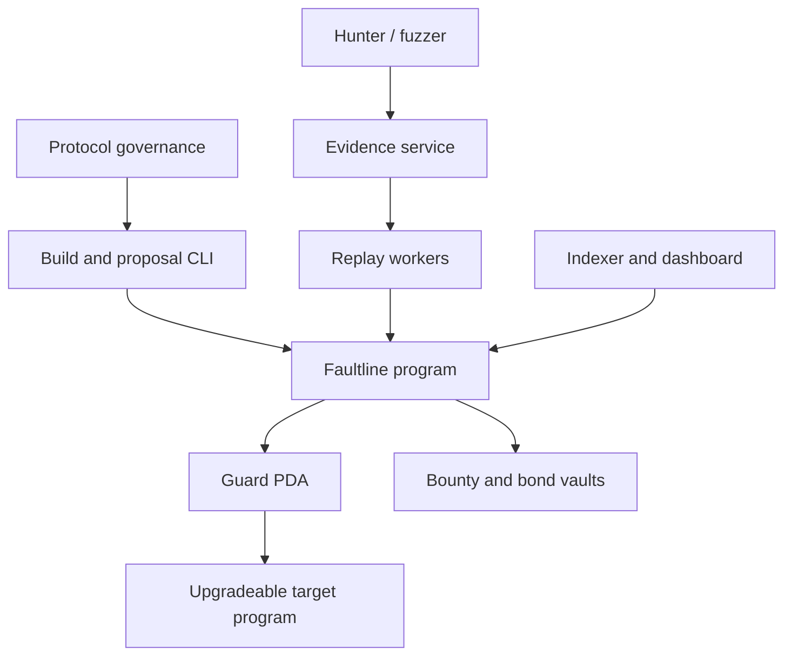
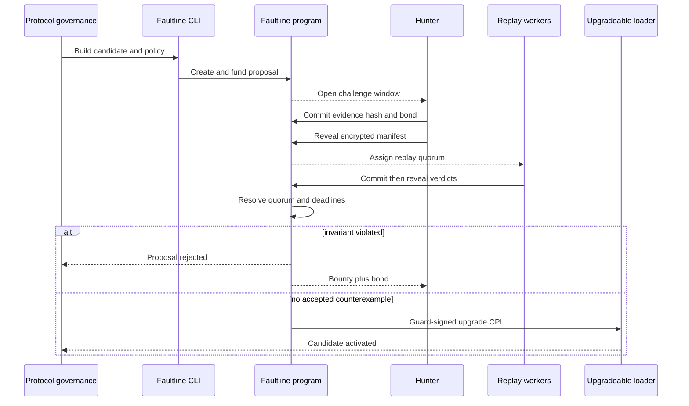
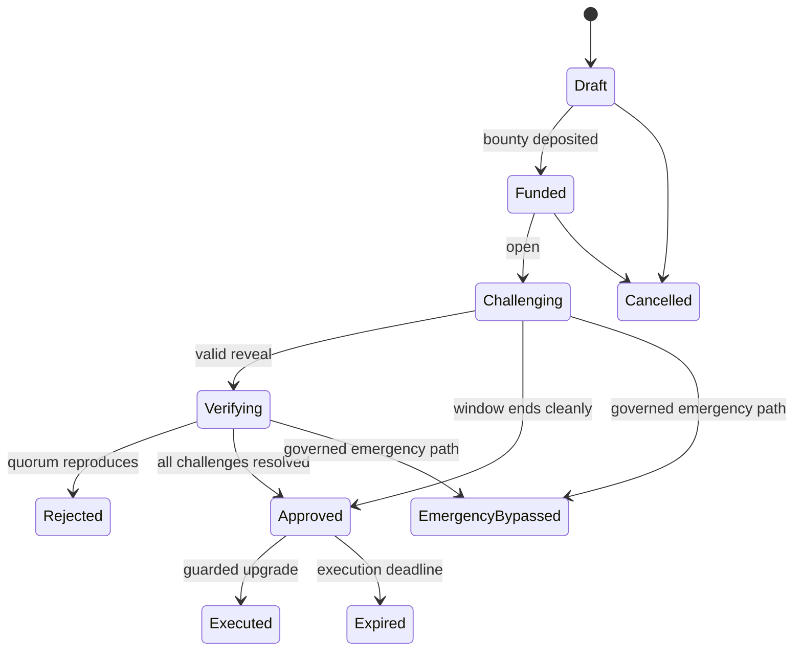
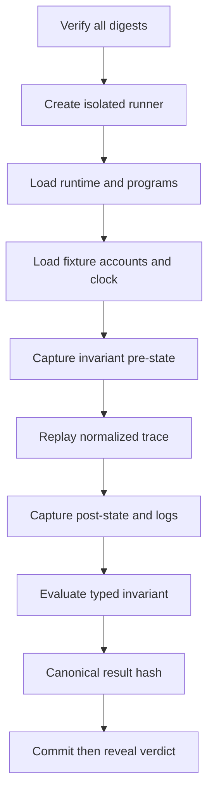
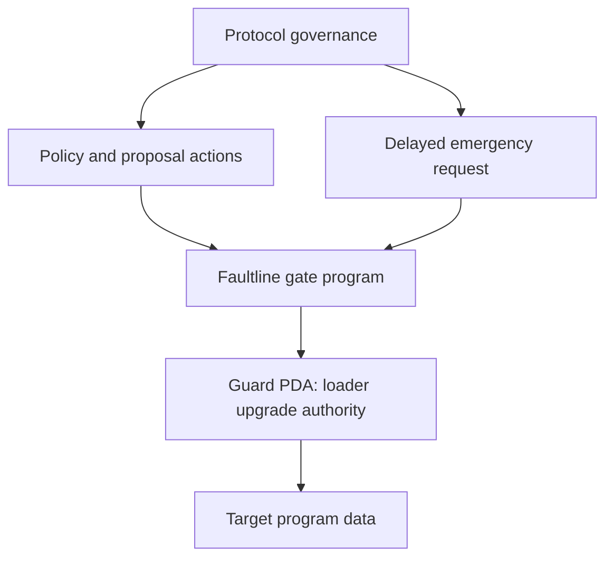

# Faultline — System Architecture

**System:** Faultline Optimistic Upgrade Gate
**Version:** 1.0
**Date:** 2026-09-12
**Status:** Implementation architecture for hackathon MVP with production evolution notes

> **Implementation status notice:** This document describes the intended architecture and is not a claim that every feature is implemented. At checkpoint `d42ef0b`, the Milestone 1-6 documents are authoritative for implemented behavior. Known current deviations include direct verifier attestations instead of verdict commit/reveal, HOLD being non-approving, temporary governance approval, partial on-chain artifact binding, Tokenkeg-only support, and no emergency path.

---

## 1. Architecture objective

Faultline must make this statement technically true:

> A candidate Solana program upgrade cannot execute through the guarded path until its immutable challenge policy is satisfied; a quorum-confirmed counterexample to a declared invariant irreversibly rejects that candidate.

Everything else—the dashboard, AI fuzzing, researcher marketplace, analytics, and explanations—is secondary.

The design separates three concerns:

1. **Onchain enforcement:** proposal state, deadlines, authority, bonds, bounty, verifier attestations, resolution, and guarded loader invocation.
2. **Deterministic offchain execution:** replaying a canonical trace against pinned program/state/runtime artifacts and evaluating a typed invariant.
3. **Untrusted product infrastructure:** indexing, APIs, artifact distribution, UI, notifications, and optional attack generation.

The onchain program does not execute an SVM inside the SVM. It verifies commitments and authorized verifier attestations, then enforces the resulting state. The MVP therefore has a verifier-trust assumption. “Deterministic replay” means honest workers running the same manifest should obtain the same result; it does not magically remove the need to secure the attestation layer.

---

## 2. Scope and assumptions

### MVP assumptions

- Solana loader-v3 upgradeable programs.
- Anchor programs for Faultline and the example treasury.
- One target program per policy.
- Three allowlisted verifier operators, 2-of-3 acceptance quorum.
- One fully implemented invariant evaluator: unauthorized treasury outflow.
- Candidate bytes stored in a loader buffer whose authority is constrained as part of proposal creation.
- Replay via a pinned LiteSVM-based runner; a local-validator/Agave cross-check is used in CI where practical.
- Public build metadata and private exploit evidence.
- Devnet/localnet and mock `fUSDC` mint for the demo.

### Production assumptions not claimed by MVP

- Open verifier admission.
- Byzantine-security under arbitrary verifier collusion.
- Deterministic replay for every external oracle/CPI/time dependency.
- Confidentiality against all selected verifiers.
- Formal soundness/completeness of invariant evaluators.
- Safe mainnet custody before independent audits.

---

## 3. System context



### Trust boundaries

| Boundary | Trusted for | Not trusted for |
| --- | --- | --- |
| Faultline onchain program | State transitions and guarded authority checks | Discovering vulnerabilities |
| Protocol governance | Policy selection, funding, emergency decision | Rewriting an active proposal |
| Build system | Producing artifact bytes | Claiming correspondence without hash/verification evidence |
| Evidence service | Availability and encrypted delivery | Integrity; all objects are content-addressed |
| Replay worker | Attesting its execution result | Acting alone; quorum is required |
| Indexer/API/UI | Convenience and derived views | Authorization or final truth |
| AI/fuzzer | Candidate trace generation | Verdict, resolution, or payout |

---

## 4. Primary end-to-end flow



---

## 5. Components

### 5.1 `faultline_gate` Anchor program

Responsibilities:

- policy creation/versioning;
- proposal lifecycle;
- deadline enforcement using the Clock sysvar;
- bounty/bond/verifier escrow accounting;
- challenge and verdict commitments;
- verifier assignment records;
- quorum resolution;
- guarded upgrade authorization;
- explicit emergency bypass records;
- immutable event trail.

It must not:

- fetch GitHub, IPFS, or HTTP resources;
- parse arbitrary policy text;
- run fuzzers;
- store binaries or raw exploit traces;
- trust an API-supplied status;
- decide vulnerability severity.

### 5.2 Example `faultline_treasury` program

Three builds share the same program ID:

- `v1-safe`: correct signer and authority constraints;
- `v2-vulnerable`: intentionally accepts an attacker-controlled authority path;
- `v3-patched`: fixes v2 and adds the exploit trace as regression coverage.

The program exposes a small, understandable state surface so judges can verify the behavior rather than trusting narration.

### 5.3 Build/proposal CLI

Commands:

```text
faultline policy init
faultline build manifest
faultline proposal create
faultline proposal fund
faultline proposal open
faultline challenge commit
faultline challenge reveal
faultline verifier run
faultline proposal resolve
faultline upgrade execute
faultline demo reset
```

Responsibilities:

- produce canonical JSON manifests;
- calculate hashes locally;
- validate target upgrade/buffer authorities;
- construct and simulate transactions;
- refuse mismatched cluster/program/policy combinations;
- print exact transaction signatures and PDA addresses.

### 5.4 Artifact service

Stores public immutable artifacts:

- source/build manifest;
- verified-build record reference;
- program executable hash;
- policy bundle;
- evaluator WebAssembly/native binary hash if used;
- runner container digest;
- public fixture manifest;
- post-resolution sanitized exploit fixture.

Use content-addressed object keys. An HTTP URL is merely a retrieval hint; the digest is authoritative.

### 5.5 Evidence service

Stores private, encrypted challenge packages until disclosure policy permits publication.

Responsibilities:

- accept client-side encrypted objects;
- enforce size/rate limits;
- return content digest and retrieval reference;
- issue short-lived worker access;
- retain audit access logs;
- delete or archive according to proposal policy.

The service cannot alter evidence undetectably because the onchain commitment covers the plaintext canonical package hash and the reveal covers the encrypted object hash/manifest.

### 5.6 Replay worker

Each worker:

1. watches assignments;
2. verifies runner, artifact, policy, fixture, and evidence digests;
3. reconstructs the deterministic environment;
4. replays setup plus transaction sequence;
5. evaluates pre/post conditions;
6. produces a normalized result;
7. commits a verdict hash;
8. reveals the verdict and signed result commitment.

Workers use separate signing keys from infrastructure/deployment keys.

### 5.7 Indexer/API

Consumes finalized/confirmed program events and account state. It builds query views for the UI but never decides proposal status.

Suggested stack for MVP:

- TypeScript service;
- PostgreSQL;
- Solana WebSocket subscriptions plus periodic signature/account reconciliation;
- object storage for public artifacts and encrypted evidence;
- queue for replay assignments and notifications.

### 5.8 Web dashboard

Suggested stack:

- Next.js App Router + TypeScript;
- Solana wallet adapter;
- generated Anchor client;
- server-side read API and client-side signing;
- no custodial keys.

Critical actions show a transaction preview containing target program, buffer, policy hash, bounty, deadline, and expected state transition.

---

## 6. Onchain account model

All seeds include a protocol domain/version prefix to prevent cross-version collisions.

### 6.1 `GlobalConfig`

```rust
pub struct GlobalConfig {
    pub version: u16,
    pub admin: Pubkey,
    pub paused: bool,
    pub allowed_payment_mints: Vec<Pubkey>,
    pub min_challenge_slots: u64,
    pub max_challenge_slots: u64,
    pub max_verifiers: u8,
    pub fee_bps: u16,
    pub bump: u8,
}
```

PDA: `[b"faultline", b"config"]`

Global pause may stop creation/settlement actions only where safe. It must never create a hidden upgrade authorization path.

### 6.2 `Policy`

```rust
pub struct Policy {
    pub version: u16,
    pub policy_id: [u8; 32],
    pub target_program: Pubkey,
    pub governance_authority: Pubkey,
    pub emergency_authority: Option<Pubkey>,
    pub payment_mint: Pubkey,
    pub challenge_slots: u64,
    pub reveal_slots: u64,
    pub verdict_slots: u64,
    pub execution_expiry_slots: u64,
    pub challenger_bond: u64,
    pub verifier_fee: u64,
    pub verifier_count: u8,
    pub reproduce_threshold: u8,
    pub invariant_bundle_hash: [u8; 32],
    pub runner_policy_hash: [u8; 32],
    pub emergency_delay_slots: u64,
    pub active: bool,
    pub bump: u8,
}
```

PDA: `[b"faultline", b"policy", target_program, policy_id]`

Policy objects are immutable once referenced by an open proposal. Changes create a new `policy_id`.

### 6.3 `GuardAuthority`

This is a zero/small-data PDA used as the target program's upgrade authority.

PDA: `[b"faultline", b"guard", target_program]`

The program signs for it only inside `execute_upgrade` or the explicit emergency path after all constraints pass.

### 6.4 `UpgradeProposal`

```rust
pub enum ProposalState {
    Draft,
    Funded,
    Challenging,
    Verifying,
    Approved,
    Rejected,
    Executed,
    Cancelled,
    Expired,
    EmergencyBypassed,
}

pub struct UpgradeProposal {
    pub proposal_id: [u8; 32],
    pub policy: Pubkey,
    pub target_program: Pubkey,
    pub program_data: Pubkey,
    pub candidate_buffer: Pubkey,
    pub proposer: Pubkey,
    pub source_commit: [u8; 20],
    pub executable_hash: [u8; 32],
    pub buffer_hash: [u8; 32],
    pub build_manifest_hash: [u8; 32],
    pub fixture_manifest_hash: [u8; 32],
    pub invariant_bundle_hash: [u8; 32],
    pub runner_manifest_hash: [u8; 32],
    pub created_slot: u64,
    pub commit_deadline_slot: u64,
    pub reveal_deadline_slot: u64,
    pub verdict_deadline_slot: u64,
    pub execute_before_slot: u64,
    pub bounty_amount: u64,
    pub fee_reserve: u64,
    pub open_challenges: u32,
    pub accepted_challenge: Option<Pubkey>,
    pub state: ProposalState,
    pub bump: u8,
}
```

PDA: `[b"faultline", b"proposal", target_program, proposal_id]`

### 6.5 Token vaults

- `BountyVault`: associated/token account controlled by proposal PDA.
- `BondVault`: token account controlled by challenge PDA or proposal accounting PDA.
- `FeeVault`: verifier fee reserve isolated from bounty capital.

Separate accounting prevents invalid challenges from consuming the promised hunter bounty.

### 6.6 `Challenge`

```rust
pub enum ChallengeState {
    Committed,
    Revealed,
    Assigned,
    Accepted,
    Rejected,
    NonReveal,
    Expired,
}

pub struct Challenge {
    pub proposal: Pubkey,
    pub challenger: Pubkey,
    pub nonce: u64,
    pub commitment: [u8; 32],
    pub evidence_hash: Option<[u8; 32]>,
    pub encrypted_object_hash: Option<[u8; 32]>,
    pub invariant_id: Option<[u8; 32]>,
    pub committed_slot: u64,
    pub revealed_slot: Option<u64>,
    pub bond_amount: u64,
    pub assignment: Option<Pubkey>,
    pub state: ChallengeState,
    pub bump: u8,
}
```

PDA: `[b"faultline", b"challenge", proposal, challenger, nonce_le]`

### 6.7 `Verifier`

```rust
pub struct Verifier {
    pub operator: Pubkey,
    pub vote_authority: Pubkey,
    pub encryption_key: [u8; 32],
    pub runner_class: u16,
    pub stake_amount: u64,
    pub active_assignments: u32,
    pub completed: u64,
    pub missed: u64,
    pub slashed: u64,
    pub active: bool,
    pub bump: u8,
}
```

PDA: `[b"faultline", b"verifier", operator]`

### 6.8 `ReplayAssignment`

Stores selected verifiers, per-worker commitment/reveal status, deadlines, and aggregate result. For the MVP a bounded fixed array of three voters avoids unbounded account growth.

PDA: `[b"faultline", b"assignment", challenge]`

### 6.9 `EmergencyRequest`

```rust
pub struct EmergencyRequest {
    pub proposal: Pubkey,
    pub authority: Pubkey,
    pub reason_hash: [u8; 32],
    pub requested_slot: u64,
    pub executable_slot: u64,
    pub executed_slot: Option<u64>,
    pub cancelled: bool,
    pub bump: u8,
}
```

PDA: `[b"faultline", b"emergency", proposal]`

The MVP may omit emergency execution from the live demo, but the authority design cannot rely on an imaginary bypass outside the program.

---

## 7. Instruction surface

| Instruction | Required signer | Key checks | Result |
| --- | --- | --- | --- |
| `initialize_config` | deploy admin | one-time init | creates config |
| `create_policy` | governance | valid bounds, target and mint | creates immutable policy |
| `deactivate_policy` | governance | no mutation to active proposals | prevents future proposals |
| `create_proposal` | governance | authority, buffer, artifact commitments | creates Draft |
| `fund_proposal` | governance/funder | correct mint/vault/amount | Draft → Funded |
| `open_challenge` | governance | funded, buffer locked, deadlines | Funded → Challenging |
| `commit_challenge` | hunter | window open, bond paid, unique PDA | creates Committed challenge |
| `reveal_challenge` | hunter | hash preimage, timing, invariant belongs to policy | Committed → Revealed |
| `assign_replay` | permissionless crank | selection rules and capacity | Revealed → Assigned |
| `commit_verdict` | selected verifier | one commitment, before deadline | records vote commitment |
| `reveal_verdict` | selected verifier | commitment preimage, normalized result | records vote |
| `resolve_challenge` | permissionless crank | quorum/deadline math | Accepted/Rejected/Expired |
| `finalize_proposal` | permissionless crank | window over, all blocking challenges resolved | Approved or Rejected |
| `execute_upgrade` | permissionless crank | Approved, not expired, exact buffer | Guard-signed loader CPI; Executed |
| `cancel_proposal` | governance | only pre-open or policy-defined safe phase | Cancelled and refunds |
| `request_emergency` | emergency governance | enabled, reason hash | creates delayed request |
| `execute_emergency` | emergency governance/crank | delay/threshold, exact candidate | loader CPI; explicit bypass record |
| `withdraw_stake` | verifier | no active assignments, cooldown | returns unlocked stake |

Every instruction has explicit account-owner, discriminator, PDA-seed, signer, mint, token-authority, state, and arithmetic checks.

---

## 8. Proposal state machine



Rules:

- `Rejected`, `Executed`, `Expired`, `Cancelled`, and `EmergencyBypassed` are terminal.
- Any accepted challenge sets `accepted_challenge` once and makes `Rejected` inevitable.
- An unresolved revealed challenge prevents normal approval until it resolves or its deterministic timeout rule applies.
- A mere commitment that never reveals cannot block after the reveal deadline.
- Proposal artifact and policy hashes never change after `open_challenge`.
- A buffer cannot be reused for a different approved proposal without a new proposal commitment.

---

## 9. Commitment schemes and domain separation

Use SHA-256 because Solana exposes hashing support and the ecosystem already uses it widely. Serialize preimages canonically; never hash ad hoc concatenated variable-length strings.

### Challenge commitment

```text
SHA256(
  "FAULTLINE_CHALLENGE_V1" ||
  cluster_genesis_hash ||
  proposal_pubkey ||
  challenger_pubkey ||
  invariant_id ||
  evidence_plaintext_hash ||
  salt_32
)
```

### Verdict commitment

```text
SHA256(
  "FAULTLINE_VERDICT_V1" ||
  assignment_pubkey ||
  verifier_pubkey ||
  normalized_verdict ||
  result_hash ||
  salt_32
)
```

### Proposal ID

```text
SHA256(
  "FAULTLINE_PROPOSAL_V1" ||
  cluster_genesis_hash ||
  target_program ||
  current_program_hash ||
  candidate_buffer ||
  candidate_executable_hash ||
  policy_pubkey ||
  build_manifest_hash ||
  fixture_manifest_hash ||
  runner_manifest_hash ||
  proposer_nonce
)
```

Including cluster and domain strings prevents replay across environments or message types.

---

## 10. Canonical artifact manifests

Canonical JSON uses UTF-8, sorted keys, no insignificant whitespace, integers for numeric quantities, and lowercase hex digests. A specific canonicalization implementation/version is included in the manifest.

### Build manifest

```json
{
  "schema": "faultline.build.v1",
  "repository": "https://github.com/example/protocol",
  "commit": "0123456789abcdef0123456789abcdef01234567",
  "workspace_path": "programs/treasury",
  "library_name": "faultline_treasury",
  "toolchain": {
    "rust": "PINNED",
    "solana": "PINNED",
    "anchor": "PINNED",
    "container_digest": "sha256:..."
  },
  "executable_sha256": "...",
  "idl_sha256": "...",
  "verified_build_record": "OPTIONAL_REFERENCE"
}
```

### Runner manifest

```json
{
  "schema": "faultline.runner.v1",
  "engine": "litesvm",
  "engine_version": "PINNED",
  "runner_image": "sha256:...",
  "solana_feature_set": "PINNED",
  "max_compute_units": 1400000,
  "max_trace_transactions": 32,
  "max_fixture_bytes": 10485760,
  "allowed_external_programs": ["..."],
  "clock_mode": "fixture",
  "oracle_mode": "snapshot"
}
```

### Fixture manifest

```json
{
  "schema": "faultline.fixture.v1",
  "base_slot": 123,
  "clock": {"slot": 123, "unix_timestamp": 0},
  "accounts_bundle_sha256": "...",
  "programs": [{"program_id": "...", "executable_sha256": "..."}],
  "token_mints": [{"address": "...", "decimals": 6}],
  "oracle_snapshots": [],
  "setup_trace_sha256": "..."
}
```

---

## 11. Counterexample trace format

The evidence package is data, not arbitrary executable code.

```json
{
  "schema": "faultline.trace.v1",
  "proposal": "...",
  "invariant_id": "AUTH-001",
  "fixture_manifest_sha256": "...",
  "transactions": [
    {
      "signer_aliases": ["attacker"],
      "recent_blockhash_mode": "runner",
      "instructions": [
        {
          "program_id": "...",
          "accounts": [
            {"pubkey_alias": "treasury", "is_signer": false, "is_writable": true}
          ],
          "data_base64": "..."
        }
      ]
    }
  ],
  "expected_violation": {
    "pre_state_selector": "treasury.token_balance",
    "post_state_selector": "treasury.token_balance",
    "relation": "post_gte_pre_for_non_admin"
  }
}
```

Restrictions:

- bounded transaction and instruction counts;
- only declared signer aliases and fixture-funded keys;
- only allowlisted programs/dependencies;
- no network access, filesystem mounts, subprocesses, or arbitrary scripts;
- deterministic recent blockhash and clock injection;
- trace parser rejects duplicate/ambiguous aliases and noncanonical encodings.

---

## 12. Invariant engine

### V1 policy representation

Use a typed enum with evaluator versioning, not a general-purpose DSL at first.

```rust
pub enum InvariantSpec {
    UnauthorizedTokenOutflow {
        treasury_account: Pubkey,
        admin_authority: Pubkey,
        allowed_fee: u64,
    },
    AssetConservationV1 { /* future */ },
    SolvencyV1 { /* future */ },
    MigrationPreservesBalancesV1 { /* future */ },
    PrivilegeBoundaryV1 { /* future */ },
}
```

### Evaluator contract

```rust
pub trait InvariantEvaluator {
    fn id(&self) -> [u8; 32];
    fn version(&self) -> u16;
    fn capture_pre(&self, vm: &VmView) -> Result<StateDigest>;
    fn evaluate(
        &self,
        trace: &NormalizedTrace,
        pre: &StateDigest,
        post: &VmView,
    ) -> EvaluationResult;
}
```

`EvaluationResult` is one of:

- `Preserved(result_hash)`;
- `Violated(result_hash, violation_code)`;
- `InvalidEvidence(error_code)`;
- `UnsupportedEnvironment(error_code)`;
- `RunnerFault(error_code)`.

Only `Violated` counts toward reproduction quorum. Infrastructure failures never count as a clean pass.

### Future DSL

A later DSL may compile into audited evaluator modules. Do not interpret the DSL dynamically onchain. The compiler, evaluator bytecode/hash, semantics version, and test vectors must be part of the policy artifact.

---

## 13. Deterministic replay pipeline



Result hash commits to:

- all input artifact digests;
- worker runner class/version;
- per-transaction success/error and compute usage;
- selected account pre/post hashes;
- log digest;
- invariant result and code.

### Sources of nondeterminism

| Source | MVP treatment |
| --- | --- |
| Clock/slot/epoch | Pinned fixture sysvars |
| Recent blockhash | Runner-generated deterministic value |
| Oracle data | Pinned account snapshot; live fetch forbidden |
| CPI program versions | Explicit executable hashes in fixture |
| Feature gates/runtime | Runner manifest pins feature set/version |
| Randomness | Forbidden unless derived from pinned inputs |
| External HTTP | Forbidden |
| Address lookup tables | Included as fixture accounts |
| Transaction ordering | Exact trace order |

Unsupported dependencies produce `UnsupportedEnvironment`, never `Preserved`.

---

## 14. Verifier selection and quorum

### MVP

- Three registered allowlisted workers.
- All three assigned.
- Two `Violated` reveals with matching normalized violation/result class accept the challenge.
- Three `Preserved`/`InvalidEvidence` results reject it according to configured rules.
- Mixed or missing outcomes follow a bounded timeout rule and may trigger one reassignment round.

Verifier selection for MVP is deterministic from:

```text
SHA256(proposal || challenge || assignment_slot_hash)
```

With exactly three allowlisted workers this is mostly an audit mechanism, not strong randomness.

### Production evolution

- stake-weight caps so wealth cannot monopolize selection;
- operator-identity diversity;
- runner-class diversity requirements;
- verifiable random selection using an appropriate Solana randomness source;
- challenge/dispute layer for divergent results;
- reproducible execution proofs or attestations where mature;
- confidential-compute option for sensitive evidence;
- explicit collusion and data-availability economics.

A 2-of-3 fleet running the same code and controlled by the same team is not decentralization. The product must label it “MVP verifier quorum.”

---

## 15. Guarded upgrade design

### Authority topology



### Normal path

`execute_upgrade` verifies:

1. proposal is `Approved` and not expired;
2. proposal target/program-data accounts match loader derivation;
3. target's current upgrade authority is exactly Guard PDA;
4. candidate buffer equals proposal buffer;
5. buffer authority/ownership is correct for the selected loader flow;
6. current target hash/version matches proposal base commitment where checked offchain and represented onchain;
7. proposal was not previously executed;
8. all loader CPI accounts are exact and no arbitrary remaining accounts alter semantics.

The program invokes the upgradeable loader with `invoke_signed` using Guard seeds, then marks the proposal `Executed`. State ordering and Solana transaction atomicity ensure either both upgrade and state change succeed or neither does.

### Buffer integrity warning

The exact availability of onchain byte hashing and loader buffer introspection must be validated against the pinned Solana/Anchor toolchain. If computing the full executable hash onchain is impractical, the architecture must prevent post-opening buffer mutation by transferring buffer authority to the Guard PDA and binding the buffer address plus verified offchain digest before the window opens. The Guard never signs buffer writes after opening.

This is a hard security requirement, not an implementation detail.

### Emergency path

There is no external secret key that also controls the target upgrade authority. A real bypass must be an instruction in Faultline or a higher-level governance topology.

Recommended beta design:

- emergency authority is a protocol-controlled multisig/governance address;
- `request_emergency` commits candidate and reason hash;
- a short configurable delay applies unless a separately reviewed break-glass policy is used;
- `execute_emergency` uses Guard PDA to invoke the loader;
- proposal terminates as `EmergencyBypassed`;
- prominent onchain event includes target, candidate, authority, reason hash, request slot, and execution slot;
- UI never presents this as a passed gate.

Faultline's own program upgrade authority must be more conservative than customer target authorities. For beta, use a separate audited multisig plus timelock and public change notice; long term consider an immutable minimal guard with versioned auxiliary programs.

---

## 16. Settlement rules

### Accepted challenge

Atomic or safely ordered settlement:

- set proposal `Rejected`;
- set challenge `Accepted`;
- return hunter bond;
- transfer bounty less explicit protocol fee, if any;
- pay eligible verifier fees from FeeVault;
- slash only objectively provable offenses;
- emit complete settlement event.

### Invalid challenge

- set challenge `Rejected` or `NonReveal`;
- forfeit configured bond portion;
- pay verifier fees from FeeVault;
- do not reduce BountyVault;
- proposal stays active unless no time remains and all challenges are resolved.

### Clean proposal

- after the commit window and resolution of all revealed challenges, set `Approved`;
- retain bounty until execution/cancellation policy settles it;
- on execution, return unused bounty/fee reserve to configured protocol destination.

### Token safety

- exact mint and token-program IDs are stored in policy;
- Token and Token-2022 support are separate adapters, not assumed interchangeable;
- transfer-fee, freeze-authority, confidential, or rebasing-like extensions are rejected in V1 unless explicitly supported;
- all destinations are derived/stored and checked;
- close-account rent destinations are fixed by policy.

---

## 17. API design

The API is read/convenience oriented. State-changing endpoints return unsigned transactions or instruction payloads; the user's wallet signs.

### Public endpoints

```text
GET  /v1/programs/:programId/policies
GET  /v1/proposals/:proposalId
GET  /v1/proposals/:proposalId/artifacts
GET  /v1/proposals/:proposalId/challenges
GET  /v1/challenges/:challengeId
GET  /v1/verifiers/:verifierId
GET  /v1/events?cursor=...
```

### Transaction-building endpoints

```text
POST /v1/tx/policies
POST /v1/tx/proposals
POST /v1/tx/proposals/:id/fund
POST /v1/tx/challenges/commit
POST /v1/tx/challenges/:id/reveal
POST /v1/tx/verdicts/commit
POST /v1/tx/verdicts/reveal
POST /v1/tx/proposals/:id/resolve
POST /v1/tx/proposals/:id/execute
```

Every response includes cluster, recent blockhash expiry, exact accounts, decoded action summary, and simulation result. Server-built transactions are never trusted blindly by the client; the client re-decodes critical fields.

### Evidence endpoints

```text
POST /v1/evidence/uploads
GET  /v1/evidence/:hash/access
POST /v1/evidence/:hash/acknowledge
```

Authenticated worker access uses signed short-lived challenges. Authorization never substitutes for digest verification.

---

## 18. Indexer schema

Suggested tables:

```text
chain_cursor(signature, slot, block_time, finalized)
policies(pubkey, target_program, version, bundle_hash, raw_account, slot)
proposals(pubkey, policy, target_program, state, deadlines..., artifact_hashes..., slot)
challenges(pubkey, proposal, challenger, state, commitment, evidence_hash, slot)
verifiers(pubkey, operator, runner_class, stake, status, slot)
assignments(pubkey, challenge, verifier_set, aggregate_status, slot)
verdicts(assignment, verifier, commitment, verdict, result_hash, slot)
settlements(proposal, challenge, recipient, mint, amount, signature, slot)
emergency_events(proposal, authority, reason_hash, requested_slot, executed_slot)
artifact_metadata(hash, media_type, size, storage_key, visibility, created_at)
```

Requirements:

- primary identities are onchain pubkeys, not database IDs;
- events are idempotent by `(signature, instruction_index, event_index)`;
- reconciliation re-reads authoritative accounts after forks/reorg-like commitment changes;
- UI distinguishes processed/confirmed/finalized commitment;
- no indexed field can authorize an onchain action.

---

## 19. Repository layout

```text
faultline/
├── programs/
│   ├── faultline_gate/
│   └── faultline_treasury/
├── crates/
│   ├── manifests/
│   ├── trace-format/
│   ├── invariant-core/
│   ├── invariant-auth-outflow/
│   └── replay-runner/
├── apps/
│   ├── web/
│   ├── api/
│   └── indexer/
├── packages/
│   ├── sdk/
│   ├── cli/
│   └── idl/
├── services/
│   ├── verifier-daemon/
│   └── evidence-service/
├── examples/
│   └── treasury-demo/
│       ├── v1-safe/
│       ├── v2-vulnerable/
│       ├── v3-patched/
│       └── exploit-traces/
├── manifests/
├── tests/
│   ├── program/
│   ├── replay/
│   ├── state-machine/
│   ├── adversarial/
│   └── e2e/
├── scripts/
│   ├── bootstrap-localnet.sh
│   ├── reset-demo.sh
│   └── run-verifiers.sh
├── docs/
│   ├── PRD.md
│   ├── Architecture.md
│   ├── THREAT_MODEL.md
│   └── DEMO.md
└── README.md
```

Do not create microservices merely to look sophisticated. The API, indexer, and evidence service may begin as one deployable backend with clean internal modules. Replay workers should remain isolated processes because they execute adversarial inputs.

---

## 20. Security threat model

### Protected assets

- target program upgrade authority;
- integrity of candidate buffer and artifact bindings;
- proposal lifecycle and liveness;
- bounty, bond, fee, and stake funds;
- confidentiality/integrity of exploit evidence;
- verifier keys and result integrity;
- public truthfulness of resolution history.

### Primary adversaries

- malicious hunter spamming or forging evidence;
- protocol proposer trying to substitute candidate bytes;
- colluding or unavailable verifiers;
- attacker stealing a worker or governance key;
- compromised artifact/evidence storage;
- hostile RPC/indexer returning stale or false data;
- Faultline administrator abusing pause/upgrade powers;
- attacker exploiting account substitution, PDA confusion, arithmetic, or token-extension behavior.

### Controls

| Threat | Control |
| --- | --- |
| Candidate swapped after challenge | Buffer authority transferred to Guard; no write-signing path; buffer/address/hash commitment rechecked. |
| Fake evidence | Bond plus deterministic replay quorum. |
| Evidence front-running | Hunter-bound commitment, salt, encrypted reveal, canonical winner rule. |
| Verdict copying | Commit/reveal with verifier-bound domain. |
| Verifier Sybil | Allowlist+stake in MVP; operator/runner diversity later. |
| Verifier non-response | Deadlines, reassignment, missed-duty penalties, bounded resolution. |
| UI/indexer deception | Wallet/client decodes instructions; direct chain/account links; onchain authority. |
| Account substitution | Strict PDA seeds, owners, mints, program IDs, and address constraints. |
| Token trickery | V1 extension allowlist/denylist and exact token-program adapter. |
| Governance bypass hidden | Only explicit emergency instruction with permanent event/state label. |
| Faultline upgrade compromised | Timelocked multisig, audits, minimal core, eventual immutability/versioning. |
| Malicious trace escapes runner | No arbitrary code, sandbox, resource bounds, no network, parser fuzzing. |
| False “pass” from runner failure | Fail closed: runner/unsupported errors are not preserved verdicts. |

### Security invariants of Faultline itself

1. Guard PDA never signs a loader upgrade unless normal or explicit emergency predicates hold.
2. A rejected proposal can never become approved or executed.
3. An approved proposal can execute at most once.
4. Open-proposal critical commitments are immutable.
5. Total escrow liabilities never exceed vault balances.
6. No challenge can settle more than its bond and configured reward.
7. Bounty cannot be drained by invalid challenge fees.
8. A verifier cannot vote twice or reveal a different preimage.
9. No unselected verifier can affect quorum.
10. Timeout paths terminate without authorizing an ambiguous upgrade.

These invariants should receive more engineering attention than the example target invariant.

---

## 21. Testing strategy

### Program unit/integration tests

- every valid state transition;
- every invalid transition from every state;
- boundary slots at `deadline-1`, `deadline`, and `deadline+1`;
- duplicate commit/reveal/resolve/execute attempts;
- wrong PDA, owner, signer, mint, vault, target, buffer, and loader accounts;
- arithmetic maximums and zero values;
- insufficient bounty/bond/stake;
- cancellation and refund matrix;
- emergency delay and labeling;
- target authority not equal to Guard;
- mutated/replaced buffer attempt.

### Property/state-machine tests

Generate arbitrary action sequences and assert the ten Faultline security invariants above. Maintain a pure reference state machine and compare it against program execution.

### Replay tests

- identical inputs produce identical result hash across repeated runs;
- v2 trace violates `AUTH-001` on all MVP workers;
- v3 trace preserves `AUTH-001`;
- altered artifact, fixture, trace, or evaluator hash fails before execution;
- unsupported CPI/oracle/clock mode returns `UnsupportedEnvironment`;
- malformed trace corpus never crashes or escapes sandbox.

### Differential tests

Where practical, replay canonical cases in both LiteSVM and local validator/Agave. Any divergence becomes a failing fixture. Production should require runner diversity rather than merely duplicating the same implementation.

### End-to-end tests

1. bootstrap cluster and mint;
2. deploy v1;
3. transfer authority to Guard;
4. propose/fund/open v2;
5. commit/reveal exploit;
6. 2-of-3 reproduce;
7. settle bounty;
8. prove execution fails;
9. propose v3;
10. finish clean window;
11. execute upgrade;
12. verify deployed hash/state.

Run the exact e2e flow at least ten times from a clean reset before recording the demo.

---

## 22. Observability and incident response

### Onchain events

Emit versioned events for:

- policy created/deactivated;
- proposal created/funded/opened/finalized;
- challenge committed/revealed/resolved;
- replay assigned;
- verdict committed/revealed;
- bounty/bond/stake settlement;
- upgrade executed;
- emergency requested/executed/cancelled.

### Metrics

- RPC lag and reconciliation drift;
- assignment queue latency;
- evidence download/decryption failures;
- replay duration and resource use;
- result divergence by runner class;
- verifier response and timeout rates;
- proposal/challenge phase duration;
- vault-to-liability reconciliation;
- emergency path use.

### Alerts

- Guard authority unexpectedly changes;
- candidate buffer authority changes after opening;
- vault balance below recorded liabilities;
- replay workers diverge;
- unresolved challenge approaches deadline;
- emergency request created;
- Faultline program upgrade proposed/executed;
- indexer state differs from direct account read.

Incident response must never “fix” onchain state through database edits. Recovery uses explicit program instructions and produces public events.

---

## 23. Deployment environments

| Environment | Purpose | Verifier set | Funds |
| --- | --- | --- | --- |
| Localnet | deterministic development/e2e | three local processes | local mock mint |
| Devnet | public hackathon demo | three project-operated workers | devnet `fUSDC` |
| Shadow mainnet | read/replay pilots, no authority | private workers | no custody |
| Beta mainnet | selected guarded pilots | audited permissioned diverse operators | real approved mint |
| Production | open/managed policy network | heterogeneous and governed | real bounties/stake |

Release artifacts include program binaries, IDLs, executable hashes, source commit, build manifest, runner digest, migrations, and rollback/emergency runbook.

---

## 24. Architecture decisions and rejected alternatives

### ADR-001 — Offchain replay, onchain attestations

**Decision:** Replay offchain; settle verifier commitments and policy result onchain.
**Reason:** Running arbitrary candidate SVM executions inside an onchain program is infeasible.
**Cost:** Verifier trust assumption.
**Evolution:** heterogeneous runners, disputes, execution proofs/attestations.

### ADR-002 — Typed invariant schema before DSL

**Decision:** Implement one audited typed evaluator first.
**Reason:** A rushed expressive DSL creates semantic ambiguity and evaluator vulnerabilities.
**Cost:** Narrow coverage.
**Evolution:** versioned compiler and audited policy packs.

### ADR-003 — PDA controls normal upgrade path

**Decision:** Guard PDA is actual loader upgrade authority.
**Reason:** Without enforcement Faultline is advisory CI.
**Cost:** Faultline becomes critical infrastructure.
**Mitigation:** minimal core, audits, explicit emergency route, staged adoption.

### ADR-004 — No native token

**Decision:** Use SPL payment assets and direct fees.
**Reason:** A token adds attack surface, regulatory noise, and fake scope without improving the MVP.

### ADR-005 — Evidence package cannot contain arbitrary code

**Decision:** Use a bounded declarative transaction trace.
**Reason:** Workers process hostile submissions; arbitrary harness code turns the product into remote-code-execution infrastructure.

### ADR-006 — No PASS on infrastructure error

**Decision:** Unsupported, unavailable, divergent, or malformed conditions are distinct from invariant preservation.
**Reason:** Conflating “could not test” with “did not break” destroys the product's credibility.

### Rejected: LLM verdicts

LLMs may generate traces or explanations but cannot reproduce and sign the final result. They are nondeterministic, prompt-injectable, and unable to provide the required execution identity.

### Rejected: storing raw exploits onchain

This leaks zero-days, increases cost, and creates permanent dangerous disclosure. Store commitments and controlled encrypted artifacts instead.

### Rejected: automatic slashing for every minority vote

Legitimate implementation divergence exists. Slash only objective non-reveal, equivocation, invalid commitment, or provably dishonest behavior until a robust dispute mechanism exists.

---

## 25. Build order

The dependency order is non-negotiable:

1. prove Guard PDA can safely control and execute the target upgrade;
2. lock candidate buffer integrity;
3. implement proposal state machine and deadlines;
4. implement the exact authorization invariant and trace runner;
5. add challenge and verdict commit/reveal;
6. add bounty/bond/verifier settlement;
7. build CLI and clean reset;
8. build indexer/API;
9. build minimal dashboard;
10. add AI fuzzing only if everything above is reliable.

Building the interface or “agent” before the authority path works is wasted effort. The onchain refusal to deploy vulnerable v2 is the product.

---

## 26. Production-readiness gates

Faultline must not custody a third-party mainnet upgrade authority until all are true:

- two independent audits of the guard and settlement programs;
- loader CPI behavior tested against the exact production runtime/toolchain;
- formalized state-machine/security invariants with property tests;
- public bug bounty for Faultline itself;
- emergency governance and timelock reviewed with the customer;
- operational key management and signer separation documented;
- at least one extended shadow-mode pilot;
- deterministic replay limitations mapped for the target protocol;
- vault/token-extension policy reviewed;
- verifier independence and failure procedures documented;
- target protocol accepts the explicit false-confidence language;
- authority recovery/immutability plan rehearsed.

The hackathon implementation should never be represented as satisfying these gates.

---

## 27. Reference baseline

- [Solana programs, loader-v3, and upgrade authority](https://solana.com/docs/core/programs)
- [Solana program deployment](https://solana.com/docs/programs/deploying)
- [Solana Verified Builds](https://solana.com/docs/programs/verified-builds)
- [SPL Governance repository](https://github.com/solana-program/governance)
- [LiteSVM repository](https://github.com/LiteSVM/litesvm)
- [Anchor documentation](https://www.anchor-lang.com/)

The architecture must pin exact dependency versions at implementation time. These links describe the baseline; they are not a substitute for testing loader behavior against the selected toolchain.
